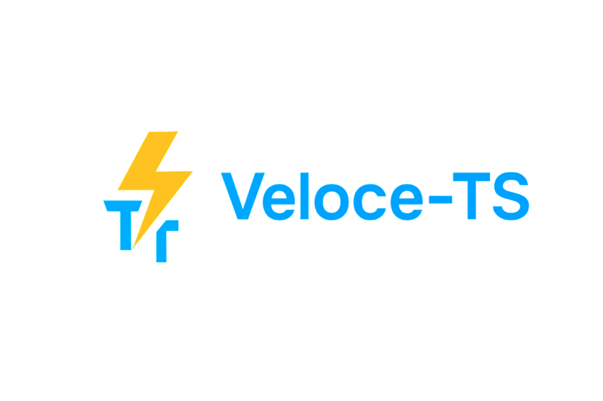

<div align="center">



---

### Modern, Fast Web Framework for TypeScript

*Inspired by FastAPI, Built on Hono.js*

[](https://www.npmjs.com/package/veloce-ts)
[](https://opensource.org/licenses/MIT)
[](https://www.typescriptlang.org/)
[](https://bun.sh/)
[](https://docs.veloce-ts.com)

[Documentation](https://docs.veloce-ts.com) • [Examples](https://docs.veloce-ts.com/guides/getting-started) • [API Reference](https://docs.veloce-ts.com/reference/api-reference)

---

</div>

> **Veloce** (Italian for "fast") brings the elegance of Python's FastAPI to TypeScript with decorators, automatic validation, and blazing-fast performance.

## ✨ Features

<table>
<tr>
<td width="50%">

### 🚀 **Performance First**
Built on Hono.js - **10x faster** than Express
- Optimized routing
- Minimal overhead
- Edge-ready

### 🎯 **Type Safety**
Full TypeScript with inference
- Zod schema validation
- Automatic type generation
- Zero runtime surprises

### ✨ **Developer Experience**
Clean, intuitive API
- Decorator-based routing
- Auto-generated docs
- Hot reload support

</td>
<td width="50%">

### 🔌 **Dependency Injection**
Built-in DI container
- Singleton, Request, Transient scopes
- Constructor injection
- Easy testing

### 🌐 **Multi-Runtime**
Write once, run anywhere
- Bun (recommended)
- Node.js 18+
- Deno
- Cloudflare Workers

### 🔧 **Extensible**
Plugin ecosystem
- OpenAPI/Swagger
- GraphQL
- WebSocket
- Custom plugins

</td>
</tr>
</table>

## 📦 Installation

```bash
# Using Bun (recommended)
bun add veloce-ts zod

# Using npm
npm install veloce-ts zod

# Using pnpm
pnpm add veloce-ts zod
```

**CLI Tool (optional)**
```bash
npm install -g veloce-ts
```

## 🚀 Quick Start

Create your first API in under 2 minutes:

```typescript
import { Veloce, Controller, Get, Post, Body, Param, Query } from 'veloce-ts';
import { z } from 'zod';

// Define validation schemas
const CreateUserSchema = z.object({
  name: z.string().min(2),
  email: z.string().email(),
  age: z.number().min(18).optional(),
});

const QuerySchema = z.object({
  page: z.string().transform(Number).default('1'),
  limit: z.string().transform(Number).default('10'),
});

@Controller('/users')
class UserController {
  @Get('/')
  async listUsers(@Query(QuerySchema) query: z.infer<typeof QuerySchema>) {
    return {
      users: [{ id: 1, name: 'John', email: 'john@example.com' }],
      page: query.page,
      limit: query.limit,
    };
  }

  @Get('/:id')
  async getUser(@Param('id') id: string) {
    return { id, name: 'John', email: 'john@example.com' };
  }

  @Post('/')
  async createUser(@Body(CreateUserSchema) user: z.infer<typeof CreateUserSchema>) {
    return { id: 2, ...user, createdAt: new Date() };
  }
}

const app = new Veloce({
  title: 'My API',
  version: '1.0.0',
  description: 'A sample API built with Veloce',
});

app.include(UserController);

app.listen(3000, () => {
  console.log('🚀 Server running on http://localhost:3000');
  console.log('📚 Docs available at http://localhost:3000/docs');
});
```

**That's it!** 🎉 Your API is now running with:
- ✅ Automatic validation
- ✅ Type safety
- ✅ OpenAPI docs at `/docs`
- ✅ Swagger UI ready

---

## 💡 More Examples

<details>
<summary><b>Functional API (No Decorators)</b></summary>

```typescript
import { Veloce } from 'veloce-ts';
import { z } from 'zod';

const app = new Veloce();

const UserSchema = z.object({
  name: z.string(),
  email: z.string().email(),
});

app.get('/users', {
  handler: async (c) => {
    return [{ id: 1, name: 'John' }];
  },
});

app.post('/users', {
  body: UserSchema,
  handler: async (c) => {
    const user = await c.req.json();
    return { id: 2, ...user };
  },
});

app.listen(3000);
```

</details>

<details>
<summary><b>With Dependency Injection</b></summary>

```typescript
import { Veloce, Controller, Get, Depends } from 'veloce-ts';

class DatabaseService {
  async getUsers() {
    return [{ id: 1, name: 'John' }];
  }
}

@Controller('/users')
class UserController {
  @Get('/')
  async getUsers(@Depends(DatabaseService) db: DatabaseService) {
    return await db.getUsers();
  }
}

const app = new Veloce();
app.getContainer().register(DatabaseService, { scope: 'singleton' });
app.include(UserController);
app.listen(3000);
```

</details>

<details>
<summary><b>WebSocket Support</b></summary>

```typescript
import { WebSocket, OnConnect, OnMessage, OnDisconnect } from 'veloce-ts';
import { z } from 'zod';

const MessageSchema = z.object({
  type: z.string(),
  content: z.string(),
});

@WebSocket('/chat')
class ChatHandler {
  @OnConnect()
  handleConnect(client: WebSocketConnection) {
    client.join('lobby');
    client.send({ type: 'welcome', message: 'Hello!' });
  }

  @OnMessage(MessageSchema)
  handleMessage(client: WebSocketConnection, message: z.infer<typeof MessageSchema>) {
    client.broadcast(message, 'lobby');
  }

  @OnDisconnect()
  handleDisconnect(client: WebSocketConnection) {
    console.log('Client disconnected');
  }
}
```

</details>

<details>
<summary><b>GraphQL API</b></summary>

```typescript
import { Resolver, Query, Mutation, Arg } from 'veloce-ts';
import { z } from 'zod';

const CreateUserInput = z.object({
  name: z.string(),
  email: z.string().email(),
});

@Resolver()
class UserResolver {
  @Query()
  async users() {
    return [{ id: 1, name: 'John' }];
  }

  @Mutation()
  async createUser(@Arg('input', CreateUserInput) input: z.infer<typeof CreateUserInput>) {
    return { id: 2, ...input };
  }
}
```

</details>

---

## 🛠️ CLI Commands

```bash
# Create a new project
veloce-ts new my-api --template rest

# Start development server
veloce-ts dev

# Build for production
veloce-ts build

# Generate OpenAPI spec
veloce-ts generate openapi

# Generate TypeScript client
veloce-ts generate client
```

**Available Templates:**
- `rest` - REST API with examples
- `graphql` - GraphQL API
- `websocket` - WebSocket server
- `fullstack` - All features combined

## 📚 Core Concepts

### Validation with Zod

```typescript
import { z } from 'zod';

const UserSchema = z.object({
  name: z.string().min(2),
  email: z.string().email(),
  age: z.number().min(18).optional(),
});

type User = z.infer<typeof UserSchema>; // Automatic type inference
```

### Middleware

```typescript
// Global middleware
app.use(async (c, next) => {
  console.log(`${c.req.method} ${c.req.url}`);
  await next();
});

// Built-in middleware
app.useCors({ origin: '*' });
app.useRateLimit({ windowMs: 15 * 60 * 1000, max: 100 });
app.useCompression();
```

### Error Handling

```typescript
import { HTTPException } from 'veloce-ts';

@Get('/:id')
async getUser(@Param('id') id: string) {
  const user = await findUser(id);
  if (!user) {
    throw new HTTPException(404, 'User not found');
  }
  return user;
}
```

## 🔌 Plugin System

```typescript
import { Veloce, OpenAPIPlugin, GraphQLPlugin } from 'veloce-ts';

const app = new Veloce();

// OpenAPI documentation
app.usePlugin(new OpenAPIPlugin({
  path: '/openapi.json',
  docsPath: '/docs',
}));

// GraphQL support
app.usePlugin(new GraphQLPlugin({
  path: '/graphql',
  playground: true,
}));
```

## 🌐 Multi-Runtime Support

| Runtime | Status | Notes |
|---------|--------|-------|
| **Bun** | ✅ Recommended | Best performance |
| **Node.js** | ✅ Supported | v18+ required |
| **Deno** | ✅ Supported | Use `npm:veloce` |
| **Cloudflare Workers** | ✅ Supported | Edge-ready |

```typescript
// Same code works everywhere!
import { Veloce } from 'veloce-ts';
const app = new Veloce();
app.listen(3000);
```

## 📖 Documentation

| Resource | Description |
|----------|-------------|
| [📚 Full Documentation](https://docs.veloce-ts.com) | Complete guides and API reference |
| [💡 Examples & Guides](https://docs.veloce-ts.com/guides/getting-started) | Tutorials and code examples |
| [🔧 API Reference](https://docs.veloce-ts.com/reference/api-reference) | Detailed API documentation |

## ⚙️ Requirements

- **Runtime**: Bun >= 1.0.0 (recommended) or Node.js >= 18.0.0
- **TypeScript**: >= 5.0.0
- **Zod**: >= 3.22.0

### TypeScript Configuration

```json
{
  "compilerOptions": {
    "experimentalDecorators": true,
    "emitDecoratorMetadata": true,
    "target": "ES2022",
    "module": "ESNext",
    "moduleResolution": "bundler"
  }
}
```

## 🤝 Contributing

Contributions are welcome! Please feel free to submit a Pull Request.

## 📄 License

MIT © 2025 Veloce Contributors

## 🙏 Acknowledgments

Built with ❤️ using:
- [FastAPI](https://fastapi.tiangolo.com/) - Inspiration
- [Hono.js](https://hono.dev/) - Core framework
- [Zod](https://zod.dev/) - Validation

---

<div align="center">

**[⭐ Star us on GitHub](https://github.com/AlfredoMejia3001/veloce-ts)** • **[📖 Read the Docs](https://docs.veloce-ts.com)** • **[💬 Join Discussions](https://github.com/AlfredoMejia3001/veloce-ts/discussions)**

Made with ⚡ by the Veloce team

</div>

